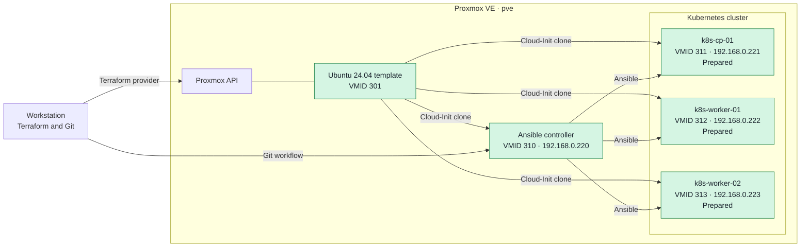

# terraform-lab

`terraform-lab` is a continuously developed homelab created to learn,
understand, and document the technologies used to build and operate modern
infrastructure. The project follows a hands-on, incremental approach: from
provisioning virtual machines with Terraform, through operating-system
configuration with Ansible, to building and operating a Kubernetes cluster.

The repository documents both successful implementations and problems found
along the way. The emphasis is on understanding how each component works, how
the components interact, and how to verify the resulting infrastructure.

## Project Goals

- Learn Infrastructure as Code by managing Proxmox virtual machines with
  Terraform.
- Understand repeatable operating-system configuration and idempotence with
  Ansible.
- Build a Kubernetes cluster from prepared Ubuntu hosts and understand its
  runtime, networking, and bootstrap process.
- Develop a containerized application and follow it from image creation to a
  verified Kubernetes deployment.
- Add cluster services, automated validation, lifecycle procedures, and
  documentation as the lab develops.
- Record design decisions, verification results, encountered problems, and
  their solutions.

The detailed implementation plan and verification gates are maintained in the
[project roadmap](docs/roadmap.md).

## Architecture



Green components are currently available. All three Kubernetes nodes are
provisioned and have passed the Ansible host-preparation workflow.

All Terraform-managed instances are cloned from a verified Ubuntu 24.04
Cloud-Init template on Proxmox VE. Terraform manages their infrastructure
lifecycle, while the Ansible controller connects to Kubernetes hosts over SSH
and configures their operating systems.

## Responsibility Boundaries

| Layer | Responsibility |
| --- | --- |
| Terraform | Provisions and manages the lifecycle of Proxmox virtual machines, networking inputs, compute resources, and Cloud-Init configuration. |
| Ansible | Configures the guest operating systems, installs packages, prepares the container runtime, and enforces Kubernetes host prerequisites. |
| Kubernetes and kubeadm | Bootstrap and operate the cluster after the hosts have passed the infrastructure and operating-system verification gates. |

Keeping these responsibilities separate makes failures easier to locate and
allows each layer to be validated before the next one is introduced.

## Current Status

The lab currently has an operational Ansible controller and three fully
prepared Kubernetes nodes. The complete host-preparation playbook is
idempotent across the cluster. The environment has also passed a complete
destroy-and-rebuild test using a newly created Ansible controller and a rotated
controller SSH key. Kubernetes bootstrap has not started yet.

| VMID | Name | Address | Resources | Current state |
| ---: | --- | --- | --- | --- |
| 300 | `ubuntu-2404-cloud-template` | — | 2 vCPU, 2 GB RAM, 20 GB disk | Legacy template retained temporarily as a rollback source |
| 301 | `ubuntu-2404-cloud-template-uefi2023` | — | 2 vCPU, 2 GB RAM, 20 GB disk | Verified Ubuntu 24.04 template with Secure Boot |
| 310 | `ansible-controller` | `192.168.0.220/24` | 2 vCPU, 2 GB RAM, 20 GB disk | Provisioned and operational |
| 311 | `k8s-cp-01` | `192.168.0.221/24` | 2 vCPU, 2 GB RAM, 20 GB disk | Provisioned; Ansible preparation verified and idempotent |
| 312 | `k8s-worker-01` | `192.168.0.222/24` | 1 vCPU, 2 GB RAM, 20 GB disk | Provisioned; Ansible preparation verified and idempotent |
| 313 | `k8s-worker-02` | `192.168.0.223/24` | 1 vCPU, 2 GB RAM, 20 GB disk | Provisioned; Ansible preparation verified and idempotent |

The verified preparation on every Kubernetes node includes required kernel
modules and network parameters, disabled swap, containerd with the systemd
cgroup driver, an active CRI plugin, and pinned Kubernetes packages. A repeated
cluster-wide play reported no changes. Cluster bootstrap has not started yet.
After the complete environment was destroyed, the controller was recreated
first, its Ansible SSH key was regenerated, and the three Kubernetes nodes were
then recreated and prepared again. The repeated Ansible run converged without
changes, and the final Terraform plan reported no infrastructure drift.

## Technology Stack

| Area | Technology |
| --- | --- |
| Virtualization | Proxmox VE, q35, OVMF/UEFI, Secure Boot |
| Infrastructure provisioning | Terraform, `bpg/proxmox` provider |
| Image initialization | Ubuntu 24.04, Cloud-Init, QEMU Guest Agent |
| Configuration management | Ansible Core |
| Container runtime | containerd |
| Cluster bootstrap | Kubernetes `1.36.3`, kubeadm |
| Cluster networking | Calico `3.32.1` planned |
| Version control and workflow | Git |

Versions are intentionally explicit. They represent the current lab standard
and will be updated through reviewed and documented changes rather than
uncontrolled upgrades.

## Key Engineering Decisions

### Separate infrastructure, configuration, and cluster bootstrap

Terraform, Ansible, and Kubernetes each have a distinct responsibility. A
machine must first exist and be reachable, then satisfy the required operating-
system configuration, before it can participate in Kubernetes bootstrap.

### Roll out changes incrementally

Configuration is first applied to a limited target. `k8s-worker-01` is the
current canary used to find and correct problems before the same configuration
is applied to the remaining nodes.

### Treat verification and idempotence as completion criteria

A successful command alone does not complete a stage. The resulting state is
inspected, and configuration-management runs are repeated to confirm that a
converged host reports no further changes.

### Pin important versions

The Terraform provider and Kubernetes components use explicit version
constraints or exact package versions. Kubernetes packages are also held after
installation to prevent unintended upgrades and version skew.

### Preserve Secure Boot

Secure Boot was not disabled to bypass an EFI certificate problem. The Ubuntu
golden image was rebuilt with a compatible 4 MB EFI variables disk and current
Microsoft UEFI certificates, then verified with a disposable clone before
Terraform was updated to use it.

### Keep the golden image minimal

The Ubuntu template provides a clean and verified base. Host-specific state and
role-specific software are added after cloning through Cloud-Init and Ansible,
instead of being embedded in an increasingly specialized image.

## Network Plan

The management network is `192.168.0.0/24`, with gateway and DNS provided by
`192.168.0.1`. The Terraform-managed static range is kept outside the router's
DHCP pool.

| Network or address | Purpose |
| --- | --- |
| `192.168.0.220-192.168.0.223` | Static addresses for the lab virtual machines |
| `10.244.0.0/16` | Kubernetes Pod network |
| `10.96.0.0/12` | Kubernetes Service network |

The Pod, Service, and host networks do not overlap.

## Repository Structure

```text
terraform-lab/
├── main.tf                       # Root module and active VM selection
├── variables.tf                  # Root input contract
├── outputs.tf                    # VM address outputs
├── providers.tf                  # Terraform and Proxmox provider configuration
├── lab.tfvars                    # Versioned, non-secret VM definitions
├── modules/
│   └── proxmox-vm/               # Reusable Proxmox VM module
├── ansible/
│   ├── inventory/                # Hosts, groups, and shared variables
│   ├── playbooks/                # Connectivity, baseline, and node preparation
│   └── roles/
│       ├── common/               # Shared operating-system baseline
│       └── kubernetes_node/      # Kubernetes host prerequisites
└── docs/                         # Roadmap, changelog, problems, and image details
```

Local credentials, private keys, Terraform state, and workstation-specific
variables are intentionally excluded from version control.

## Roadmap

Development is organized into verified phases. The current work is completing
Kubernetes host preparation on all three nodes. Later phases cover cluster
bootstrap, container application development, cluster services, application
deployment, automated quality checks, and lifecycle documentation.

See [docs/roadmap.md](docs/roadmap.md) for the complete plan, current progress,
and the verification gate for each phase.

## Documentation

- [Roadmap](docs/roadmap.md) — implementation phases, current state, and
  verification gates.
- [Changelog](docs/changelog.md) — completed work and recorded validation
  results.
- [Problems](docs/problems.md) — encountered failures, investigation results,
  and implemented solutions.
- [Ubuntu golden image](docs/ubuntu-golden-image.md) — template configuration,
  cleanup, and verification.

## Security Notes

- Secrets, private keys, local Terraform variables, and state files are not
  committed to the repository.
- The administrator key remains on the workstation, while the dedicated Ansible
  private key remains on `ansible-controller`.
- Only public keys are supplied to virtual machines through Terraform and
  Cloud-Init.
- Secure Boot remains enabled for the current template and its clones.
- Addresses documented in this repository belong to a private laboratory
  network and are not public endpoints.

Reproduction and recovery instructions will be added after the environment and
its lifecycle procedures are complete and verified.
